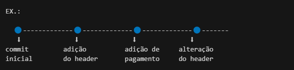
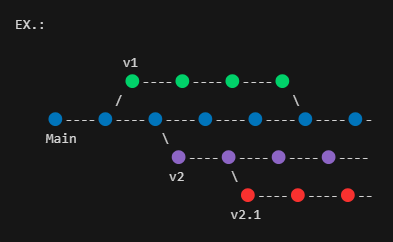

# Conceitos

### Git

Git é um software de versionamento de projetos, capaz de rastrear
alterações em qualquer conjunto de arquivos, geralmente usado
para coordenar o trabalho entre programadores que desenvolvem um
código-fonte de forma colaborativa durante o desenvolvimento de 
software. Seus objetivos incluem velocidade, integridade de dados e
suporte para fluxos de trabalhos não lineares distribuídos.

[Download do Git](https://git-scm.com/downloads)

***

### Repositório

Essencialmente git repositório é uma diretório chamado .git 
dentro do seu projeto.
Este repositório restreia todas as mudanças feitas nos arquivos 
dou seu projeto, construindo um histórico ao longo do tempo.

***

### Commit
Podemos definir o commit como um marco histórico do seu projeto,
quando você "commita" está salvando o seu projeto naquele estádo,
durante o desenvolvimento do seu projeto você vai "commitando" sempre 
que finalizar uma parte que você julga importante, criando assim 
uma linha versionamento, uma branch, onde cada commit é uma versão do seu projeto  

> ### Estágios do commit
  1. **Modified**

Um arquivos entra nesse estágio automaticamente sempre que é 
alterado, assim você quais arquivos foram alterados desde a 
ultima versão.
  
 2. **Staging**

  O staging deixa os arquivos modificados em destaque para 
  serem "commitados", assim você especifica, por meio de comando,
  quais arquivos que estão no modified que deseja "commitar", 
  pode ser quais arquivos você desejar, inclusive todos.
  
 3. **Committed**
   
Nesse estágio os arquivos foram "commitados" e foi criado um
novo commit na branch.
***
### Branch
  Branchs são como copias do seu pojeto onde você pode fazer alterações
  separadas e "commita-las", gerando assim uma outras versão do projeto
  que pode ser desenvolvida em paralelo com a branch Main, a versão 
  principal. Com forme a necessidade você pode criar branchs a partir
  de outras branchs e depois junta-las. 

---
by : Adrian Pereira - [LinkedIn](https://git-scm.com/downloads) - [GitHub](https://github.com/adrianPers)